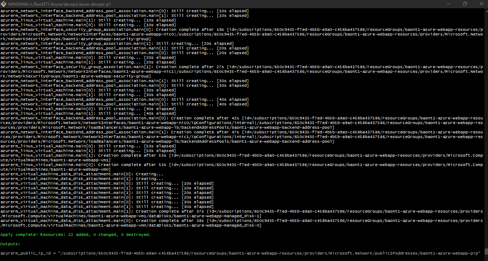
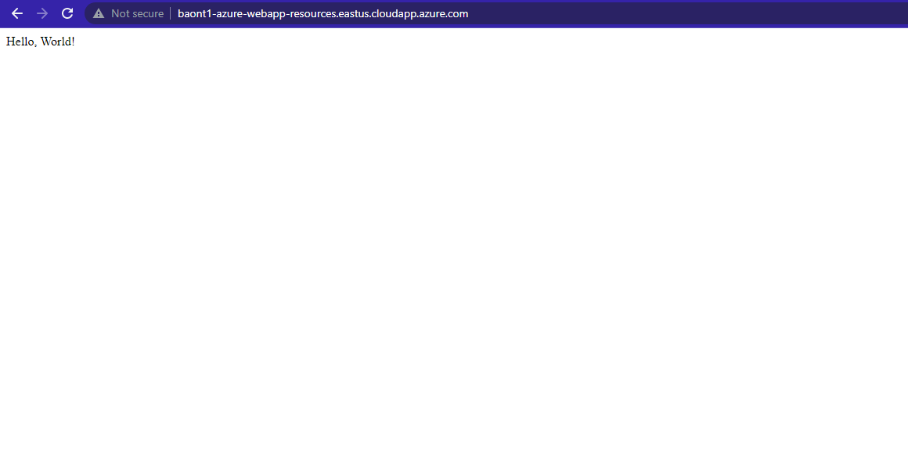

# Azure Infrastructure Operations Project: Deploying a scalable IaaS web server in Azure

### Introduction
For this project, you will write a Packer template and a Terraform template to deploy a customizable, scalable web server in Azure.

### Getting Started
1. Clone this repository

2. Create your infrastructure as code

3. Update this README to reflect how someone would use your code.

### Dependencies
1. Create an [Azure Account](https://portal.azure.com)

2. Install the [Azure command line interface](https://docs.microsoft.com/en-us/cli/azure/install-azure-cli?view=azure-cli-latest)

3. Install [Packer](https://www.packer.io/downloads)

4. Install [Terraform](https://www.terraform.io/downloads.html)

### Instructions
1. Deploy an Azure policy that ensures all indexed resources are tagged
    - Create the Azure policy definition by 
    ```
        ./create_az_policy_definition.sh
    ```

    - Create the Azure policy assignment by 
    ```
        ./create_az_policy_assignment.sh
    ```

    - Verify policy effectiveness by creating index resources

2. Create a Packer image deployable by Terraform
    - Create an image resource group named `packer-baont1-rg` by: 
    ```
        az group create --location eastus --name packer-baont1-rg
    ```

    - Create a Service Principal for Terraform named `BaoNT1TerraformSP` by: 
    ```
        az ad sp create-for-rbac --role="Contributor" --scopes /subscriptions/{subscriptionId} --name="BaoNT1TerraformSP"
    ```
    Outputs 5 values: `appId`, `displayName`, `name`, `password`, and `tenant`.

    - Export environment variables `ARM_CLIENT_ID` and `ARM_CLIENT_SECRET` that correspond to the above `appId` and `password`, respectively, as well as `ARM_SUBSCRIPTION_ID` which is the Azure Subscription ID (for the sake of simplicity, one may create a shell script, say [azure_env.sh](azure_env.sh), and run it by 
    ```
        source azure_env.sh
    ```
    
    - Complete the Packer template file [server.json](server.json)
    
    - Create the image by: 
    ```
        packer build server.json
    ```

3. Deploy Azure resources with Terraform
    - Complete terraform configuration files
    - Plan the Terraform deployment: 
    ```
        terraform plan -var-file terraform.tfvars -out terraformPlan.out
    ```

    - Apply the Terraform deployment: 
    ```
        terraform apply "terraformPlan.out"
    ```

4. Destroy all Azure resources
    - Destroy resources built by Terraform: 
    ```
        terraform destroy
    ```

    - Destroy image built by Packer: 
    ```
        az image delete -g packer-baont1-rg -n packer-baont1-image
    ```

### Output
1. Terraform output



2. Open [the deployed webserver](http://baont1-azure-webserver-resource-group.eastus.cloudapp.azure.com/) in the browser

